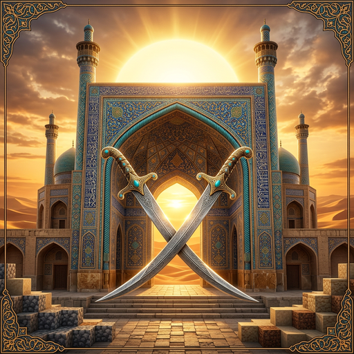

# ✦ Persian Legacy — میراث پارسی ✦
### ریسورس پک فتورئال ایرانی با طراحی PvP-First برای Minecraft 1.20+



ترکیب **فتورئالیسم 8K** با **هنر اصیل ایرانی** — نقش‌برجسته‌های تخت جمشید، کاشی‌کاری اصفهان، منبت خاتم، فیروزه و طلا — بدون قربانی‌کردن حتی یک فریم در PvP.

---

## 📦 محتوا

| بخش | توضیح |
|---|---|
| 🧱 **بلاک‌ها (1024x + PBR)** | سنگ تخت‌جمشید، آجر یزد، کاشی اصفهان، خاتم‌کاری، موزاییک فیروزه، طلای هخامنشی + نقشه‌های LabPBR (Normal/AO/Height/Smooth/F0/Emissive) |
| ⚔️ **سلاح‌های PvP** | شمشیر شمشیرِ دمشقی، کمان پارسی — مدل مسطح، Hitbox دقیق، بدون افزونه ۳بعدی مزاحم |
| 🖥 **HUD پارسی** | قلب فیروزه‌ای با لبه طلایی، Hotbar شفاف با قاب گره‌چینی، Crosshair ستاره هشت‌پر (شمسه)، XP طلایی |
| ✨ **پارتیکل‌ها** | کریت طلایی و گلینت فیروزه‌ای پرکنتراست + موج شمشیر فیروزه→طلا |
| 🌍 **بایوم‌ها** | Colormap جنگل هیرکانی / کویر لوت / البرز + آب فیروزه‌ای (OptiFine) |
| 🌌 **آسمان** | خورشید با هاله طلایی، ۸ فاز ماه خودکار، اسکای‌باکس کویر روز/شب پرستاره (OptiFine) |

## 🚀 نصب

1. `release/PersianLegacy-PvP-v1.0.zip` را در `.minecraft/resourcepacks` کپی کنید.
2. در بازی: Options → Resource Packs → فعال کنید.
3. برای PBR و آسمان سفارشی: **OptiFine** یا **Fabric + شیدر LabPBR** (راهنما: [`docs/shader-guide.md`](docs/shader-guide.md))

## 🛠 ساخت مجدد از سورس

```bash
pip install pillow numpy
python3 tools/build_pack.py              # نسخه کامل 1024x
python3 tools/build_pack.py --res 512    # نسخه سبک PvP رقابتی
python3 tools/build_pack.py --res 2048   # نسخه اولترا (عکاسی)
```

اسکریپت به‌صورت خودکار: ساختار پوشه‌ها را می‌سازد، تکسچرها را Seamless و Mipmap-Safe می‌کند، نقشه‌های PBR تولید می‌کند، HUD را روی مختصات دقیق وانیلی بازطراحی می‌کند، PNGها را Lossless فشرده و ZIP نهایی را می‌سازد.

## 📁 ساختار مخزن

```
├── PersianLegacy/          ← خود ریسورس پک (قابل استفاده مستقیم)
│   ├── pack.mcmeta
│   ├── pack.png
│   └── assets/minecraft/...
├── src_textures/           ← تکسچرهای خام تولیدشده با AI
├── tools/build_pack.py     ← اسکریپت خودکارساز کامل
├── docs/
│   ├── midjourney-prompts.md   ← ۱۰ پرامپت پایه
│   ├── upgraded-prompts.json   ← ۱۰ پرامپت ارتقایافته v3 (+negative)
│   ├── expansion-prompts.md    ← ۱۶ پرامپت تکمیلی (ماب‌ها/۱.۲۱/سیمرغ)
│   ├── audit-report.md         ← گزارش ممیزی QA کامل
│   ├── missing-assets.md       ← چک‌لیست شکاف دارایی‌ها
│   ├── qa-metrics.md           ← سنجه‌های خودکار Seam/PBR هر بیلد
│   ├── shader-guide.md         ← راهنمای عمومی شیدر PvP
│   └── shader-config.md        ← کانفیگ آماده SEUS PTGI / Kappa
├── vanilla/                ← فایل‌های مرجع 1.20.1 (پایه بازطراحی HUD)
└── release/                ← ZIP نهایی
```

## ⚡ فلسفه PvP-First

- **Hotbar شفاف** → دید کامل به زمین زیر پا
- **Crosshair مینیمال** → مرکز دید همیشه باز
- **مدل سلاح کوچک‌شده در First-Person** → سمت راست صفحه کور نمی‌شود
- **رزولوشن توان-۲ + Mipmap** → بلاک‌های دور خودکار سبک لود می‌شوند؛ FPS پایدار
- **پارتیکل فیروزه/طلا** → ضربه‌ها در شلوغی فایت گم نمی‌شوند
